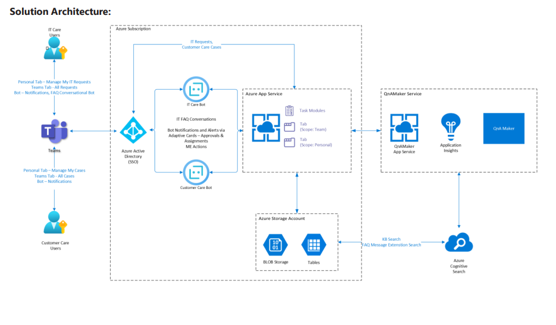
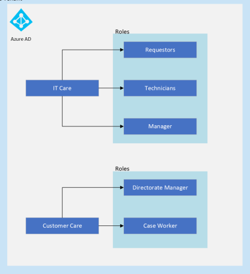
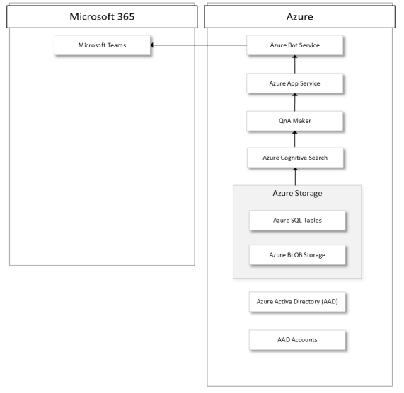
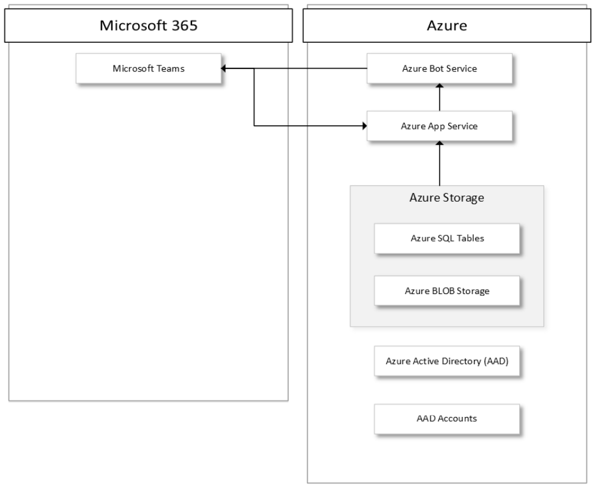

## Overview

The Application template has the following main components:

- [**Azure App Service**](#azure-app-service): Hosts the API endpoints, including the bot messaging endpoint, and serves the static site for tabs and task modules.
- [**Azure Storage Account**](#azure-storage-account): Stores all application data, such as tickets and requests. It also allows for customization of the towns and ticket categories that is used by the application. See the deployment Guid for Configuration
- [**Azure Active Directory**](#azure-active-directory): Provides single sign-on for staff members in Teams. Also secures communication between the bot and Azure Bot Service.
- [**Microsoft Graph API**](#microsoft-graph-api): Provides integration with O365 for determining Microsoft Team Channels and Members/Owners of the channels.
- [**QnA Maker Service**](#qna-maker-service): Provides integration to a custom built Question and Answer Service.

## Azure App Service
This service hosts the Api Endpoint as well as the bot activities required by the solution. The Api endpoint is used in both data access to the application and any notifications to be routed to channels.

The services additionaly serves the react UI static files required by the application.

## Azure Storage Account
Azure Storage Account stores all application data in various tables and blobs.

## QnA Maker Service
QnA Maker is a cloud-based Natural Language Processing (NLP) service that allows for the creation of a custom knowledge base (KB) to built according to the customer's needs. It can be trained to handle Q&A questions and published to a service. The IT Care bot utilises this service to provide answers to the most common IT Tickets raised by users.

## Azure Active Directory
The Azure Active Directory provides the Authorization and Authentican channels for the teams and bot services to be able to communicate securely with each other. Users are also authenticated and authorized against the provider for a single sign on experience. 

## Microsoft Graph API
The Microsoft Graph API is used by the front end to retrieve channel information as well as channel owners and members. This gives the application the ability to assign requests and tickets to individuals or team channels. 

Scopes required by the application

| Scope  | Type   | Description  | Admin Consent  |
|---|---|---|---|
| Channel.ReadBasic.All  | Delegated  | Read the names and descriptions of channels  | No  |
| ChannelMember.Read.All  | Delegated  | Read the members of channels  |  Yes |
| Presence.Read.All  | Delegated  | Read presence information of all users in your organization  | No  |
| Sites.ReadWrite.All  | Delegated  | Edit or delete items in all site collections  | No  |
| User.Read  | Delegated  |  Sign in and read user profile | No  |
| User.Read.All  | Application  | Read all users' full profiles  | Yes  |
| User.ReadBasic.All  | Delegated  | Read all users' basic profiles  | No  |

## Personas

## IT Care

## Customer Care
