# Care Application Deployment and Configuration

## Overview

Download or clone the repository to get access to the source code for the project. 

## Build Requirements

This guide makes use of the Teams Toolkit Extension for VS Code and can be found here. https://docs.microsoft.com/en-us/microsoftteams/platform/toolkit/teams-toolkit-fundamentals 

## Deploying Backend Bot API

The .NET Api is deployed via Visual Studio 2022. This document serves as a step-by-step process on how to setup and deploy the application to an Azure tenant  

Open the solution in visual studio 2022
Right click the solution in the solution explorer and select &quot;Publish&quot;

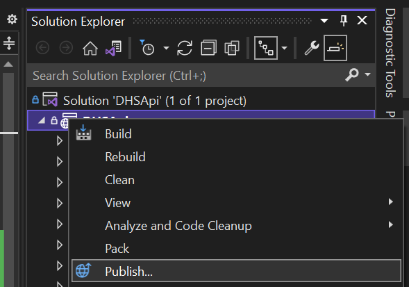

Select New

Select Azure as your target

Select Azure App Service (Windows) 

Select your azure subscription and then click the + under app service instances 

Give the app a name and service plan, and create a resource group 

Click Create

Click Next 

Skip the API Management and click Next 

Click Finish 

On the publish profile created click Configure under service dependencies 

Add a storage new storage account ( + ) 

Give your storage account a name, and select the correct resource group 

Click Create

Once created, select your storage account 

Click Next
Don&#39;t change anything on this prompt, but take not of your **DefaultConnectionstring** 

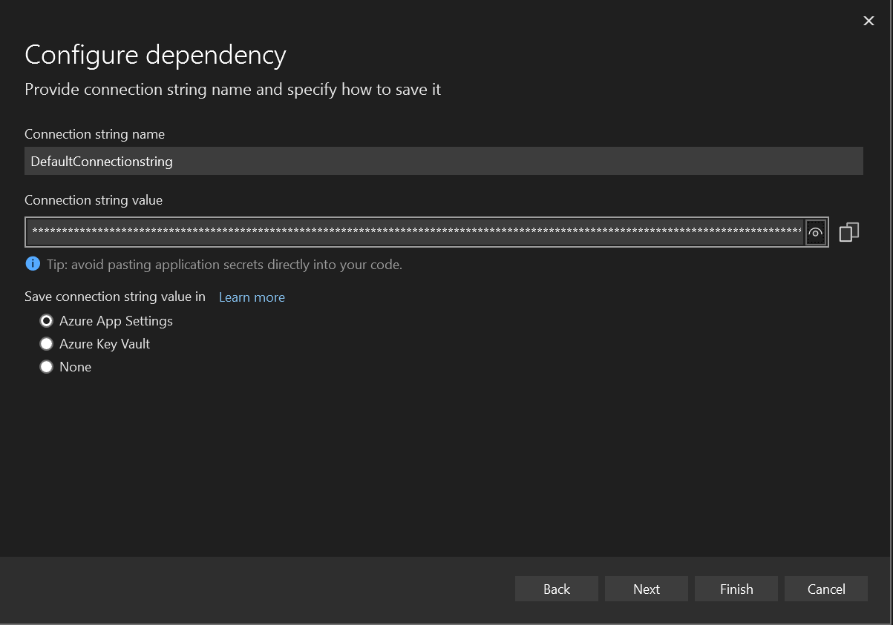

Click Finish
Head over to [https://portal.azure.com](https://portal.azure.com/) and search for App Services

Find your newly created app with the name you provided it.

Click Configuration then New Application Setting 

Add the **DefaultConnectionstring** you took note of earlier 

Click Ok, and then save the configuration to take effect.

Lastly navigate to the Overview pane and copy the Endpoint Url into a new file that will be used throughout the rest of the installation. 

## Provisioning the teams application

In Visual Studio Code, make sure that the latest version of the Teams toolkit is installed. Navigate to the extension and login to both the tenant and Azure Accounts.

Next, we need to create an environment for our deployment. This can be done by clicking the + button on the environment section (copy from dev when asked). Enter a new name for the environment when prompted to do so.

Once the environment has been created, click on the provision to cloud item in the deployment tab. This will take some time for the resources to be created. 

After the app has been provisioned in the cloud, a couple of new files will appear in the project. We will update these at a later stage. For the next stage we can just click on the deploy to cloud to setup the resources in Azure. 

Navigate to [https://portal.azure.com](https://portal.azure.com/) and sign into your account. This account needs administrative permissions to allow the app scopes on the registration. 

Once there, navigate to the Azure Active Directory menu item. 

Next navigate to the App Registrations menu item. 

Click on the item that we created. 

Navigate to the Api Permissions menu item 

Click on the scopes with the warning triangle and the click on the grant access button for both 

Navigate to the Overview file and copy the Application Client Id, Object Id and Tenant Id to the same file. You should now have something like this. 

Once this is completed close the pane and add a new registration. Make sure Multitenant is picked

Next navigate to the Certificates and Secrets menu item

Click on New Client Secret 

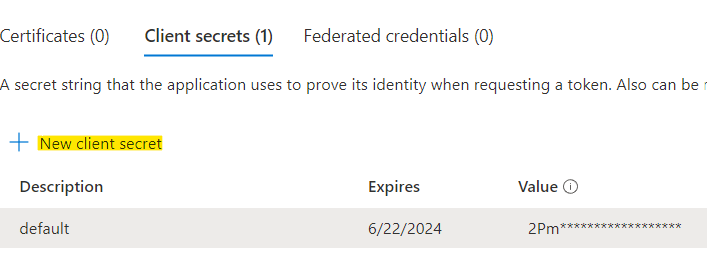

Click on Add. NOTE, copy the secret value to a file as this cannot be retrieved at a later stage.

Navigate to the Overview file and copy the Application Client Id to the same file. You should now have something like this.

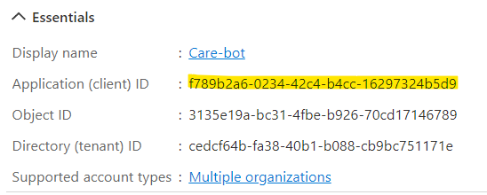

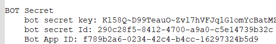

Once this is done, navigate back to the first aad app registration

Navigate to the expose an API menu item

Click on the edit pencil button and update the URL.

Change the URL from the last backslash to be /botid- f789b2a6-0234-42c4-b4cc-16297324b5d9. This value can be found in the text file.

Save the value.

## Setting up QnA Maker

Navigate to [https://portal.azure.com](https://portal.azure.com/) and find the subscriptions menu item 

Click on your subscription

Next click on the subscription Resource providers menu item

Make sure that the Microsoft Search resource provider is registered

Navigate to [https://www.qnamaker.ai](https://www.qnamaker.ai/)

Click **Create a knowledgebase**

Click Create a QNA Service 

Follow the prompts to create and register the QNA Service against your tenant

Once that&#39;s done, navigate back to [https://www.qnamaker.ai](https://www.qnamaker.ai/)

 Click &quot;Create a KnowledgeBase&quot;

Follow Step 2&#39;s instructions

Name your Knowledge base in

Click Create

Navigate to &quot;My Knowledge bases&quot;

Select your knowledge base that you named

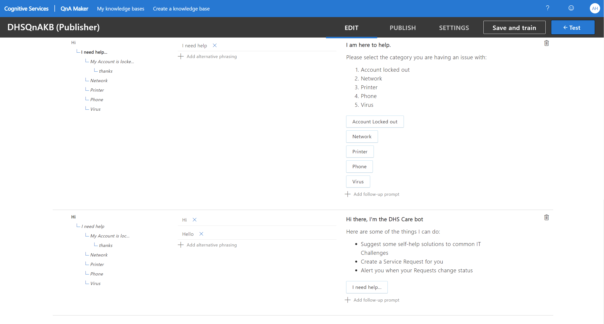

The end user can setup conversational flow with the bot here.

_Markdown notes: https://docs.microsoft.com/en-us/adaptive-cards/authoring-cards/text-features_

Once complete, click Save and Train in the top right.
Then Click on Publish top right. And then publish again

Make a note of the deployment details here. It will be used later when configuring the backend Api service  

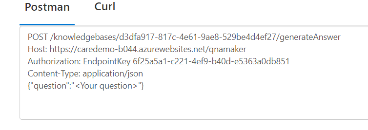

Your text file should look like this at the end of the registration  

## Creating the bot

Navigate to portal.azure.com

Log into your tenant subscription

Click &#39;Create a Resource&#39; under azure services

Search for &#39;Azure bot&#39; and click &#39;Create&#39; 

Give the bot a handle

Select your subscription group

Select the resource group that you created for the API

The Type of the app is &#39;Multi Tenant&#39;

Select use existing app registration

The AppID can be found on the keys and registrations file

Click Review &amp; Create

Navigate to the newly created Bot&#39;s configuration Tab

Make sure the endpoint is configured to the url of the deploy&#39;d API postfixed with /api/messages.
 Example: [https://api.azurewebsites.net/api/messages](https://api.azurewebsites.net/api/messages)

Next, click on the channels menu item  

Find Microsoft teams in the Available channels and click on it

Lastly, enable the channel.

## Creating the Teams Application Packages

From Visual Studio Code, in the Teams toolkit extension click on the Zip Teams Metadata package.

Navigate to the SourceDir\ClientApp\build\appPackage folder and there will be a zip file with the name appPackage.YourEnvironment.zip.

Copy this file to a new folder in c:\temp for example. We will need to create two copies of this zip file to be able to deploy bot applications in teams.

Rename the files accordingly

Extract both files to the same directory

### Customer Care Manifest Configuration

Navigate into the appPackage.CustomerCare1.0 folder and open the manifest.json file in a text editor.

Change the values accordingly

Next, we need to update the Bot Id to that of the App Registration Application Id. This can be found from the text file we have.

Since this is the customer care application, we should remove the static tab for IT Care (Delete the highlighted section).

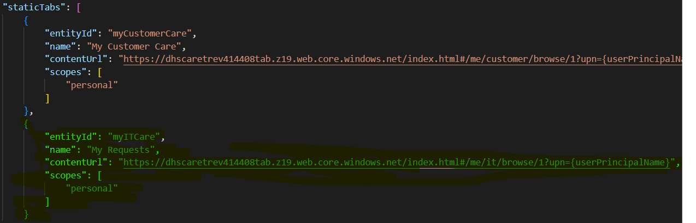

Lastly, ensure that the valid domains is correct by adding the Api Endpoint domain from the file into the valid domains

Now in the web application info section, change the Url to end with botid-YOURBOTID

Save the file and close it.

### IT Care Manifest Configuration

Navigate into the appPackage.ITCare1.0 folder and open the manifest.json file in a text editor.

Change the values accordingly (Note that the last two letters of the Id also changed. This is required to upload bot the IT Care and Customer Care distinct applications)

Next, we need to update the Bot Id to that of the App Registration Application Id. This can be found from the text file we have.  

 

Change the configuration Url on the configurable tabs section. The endpoint should be tabconfigitcare.   

Since this is the IT care application, we should remove the static tab for Customer Care (Delete the highlighted section).

Ensure that the valid domains is correct by adding the Api Endpoint domain from the file into the valid domains  

 

 

Now in the web application info section, change the Url to end with botid-YOURBOTID  

Before closing the document, make a note of the content URL specified in the IT Care tab. Copy this to the file on hand as well. Place it under IT Care Content section

Additionally, copy the resource path built up in the web application info section to the file.

Save the file and close it.

## Registering Teams Applications

Delete the original zip files in the temp directory so that we can recreate them. Next create the new zip files from the directories with the same names. NOTE that there should not be subdirectories in the zip files and the content should be in the root of the zip.

Navigate to [https://admin.teams.com](https://admin.teams.com/) and sign in.

Navigate to the Manage Apps Menu Item

Click on the Upload App button and browse the temp folder where the zip files were created. Both the application files should be uploaded.

After the uploads, type in Care or the name you have provided in the manifest files to find the two applications.

Click on the Customer care link to retrieve the details of the registration. We need to add this to the text file on hand.

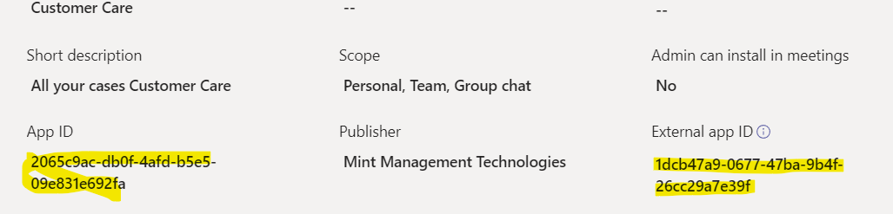

Your text file should now look like this

## Team Channels Creation

Navigate to [https://admin.teams.com](https://admin.teams.com/) and sign in.

Click on the Manage teams menu item

Click on the Add button

We need to create two PUBLIC teams for the two applications.

Navigate to teams and find the newly created teams in the app.

Click on the ellipses next to the General tab and then on the Get Link to team button

Copy the value above into the text file and do the same for the IT Care channel. The text file should now look like this

Lastly, extract the group Id from both Urls into the respective channels. This can be found by finding the following in the url:

[https://teams.microsoft.com/l/team/.../conversations?groupId=_ **43049863-ef8f-476a-9543-28385ccda4bd** _&amp;tenantId=cedcf64b-fa38-40b1-b088-cb9bc751171e](https://teams.microsoft.com/l/team/.../conversations?groupId=43049863-ef8f-476a-9543-28385ccda4bd&amp;tenantId=cedcf64b-fa38-40b1-b088-cb9bc751171e)

The file should now look like this

## Configuring the backend Api

Next we need to open Visual Studio again with our backend service and add the configuration to the AppSettings.json file.

Each value needed to populate the file can be found in the file.

- FAQSettings.Endpoint – File QnA Maker Host
- FAQSettings.RequestPath - File QnA Maker Post
- FAQSettings.AuthorizationKey - File QnA Maker EndpointKey
- FAQSettings.ClientAppId - File App Registration Application Id
- FAQSettings.CreateRequestViewURL – Set via Environment (REMOVE)
- DefaultConnectionString: Set via Environment (REMOVE)
- MicrosoftAppId - File Bot Bot App ID
- MicrosoftAppPassword – File Bot Secret bot secret key
- MicrosoftAppTenantId – File App Registration Directory tenant id (Optional)
- APIKeys – **Change to values that your application can use** and keep a note of the updated values

After the edit, the file should look like this 

Once the configuration is done, we need to re-publish the application for the changes to take effect.

## Configuring the Teams Applications

In VS Code in the client app, find the environment file that was created in the initial steps. The name should be .env.teamsfx.environmentname

Paste the following section into the file below the existing content.

REACT\_APP\_GRAPHSCOPE=openid profile Presence.Read.All User.Read User.ReadBasic.All Sites.ReadWrite.All Channel.ReadBasic.All ChannelMember.Read.All

REACT\_APP\_ADD\_DEBUGUSERS=false

REACT\_APP\_CUSTOMERCARE\_GROUPID=3fc544f4-7858-4584-86c2-c28920625e5b

REACT\_APP\_ITSUPPORT\_GROUPID=43049863-ef8f-476a-9543-28385ccda4bd

REACT\_APP\_APIENDPOINT\_TOKEN=c940e013-e7c9-4f7b-870b-be07b70d311f

REACT\_APP\_APIENDPOINT\_URL=https://caredemo-b044.azurewebsites.net

REACT\_APP\_CUSTOMERCARE\_APPID=2065c9ac-db0f-4afd-b5e5-09e831e692fa

REACT\_APP\_ITSUPPORT\_APPID=94d05d56-95e1-4344-b6bd-9ce23021369d

REACT\_APP\_SCOPED\_CUSTOMERCARE=false

The values should be replaced with the following

- REACT\_APP\_CUSTOMERCARE\_GROUPID – File Customer Care App Group Id
- REACT\_APP\_ITSUPPORT\_GROUPID – File IT Care App Group Id
- REACT\_APP\_APIENDPOINT\_TOKEN – An allowed api key specified in your Api endpoint application.json file
- REACT\_APP\_APIENDPOINT\_URL – File API Backend Endpoint
- REACT\_APP\_ITSUPPORT\_APPID – File IT Care App App ID
- REACT\_APP\_CUSTOMERCARE\_APPID – File Customer Care App App ID

Lastly deploy the application to the cloud.

## Update Backend Api Create View Url

Navigate to [https://portal.azure.com](https://portal.azure.com/) and find the app service host. Click on the App Service

Navigate to the configuration menu item

Click on the new application setting button

From the text file, copy the IT Care Content Url

This is the base Url we need to change to allow for the creation of a ticket from an adaptive card.

Change the end of the url to point to /#/me/it/new/XXX/new where XXX is the Group Id for the IT Care App

The end result should look like

https://dhscaretrev414408tab.z19.web.core.windows.net/#/me/it/new/43049863-ef8f-476a-9543-28385ccda4bd/new

Populate the form with the following values

- Name - Settings\_\_FAQSettings\_\_CreateRequestViewUrl
- The url just created

Click ok and then Save

## Add Applications to teams

Navigate back to Microsoft teams and find the channels that we created. On the customer care Channel, click the ellipses and then on manage team

Click on the Apps tab and then click on the More Apps button

Find the Customer Care App and then click on it

Search the customer care team when prompted and add it there.

Lastly click on setup, Do the same to add the IT Care Application to the IT Care channel.

At the end your channels should look like the following.

## Seeding Town and Ticket Category Data

The DHS Teams application uses Azure Table storage to persist the data in. There are two configurable tables that has an impact on the UI displayed to the end user.

### Town

The town table is used to configure the list of towns displayed on the customer care application new/edit case.

### Ticket Category

The ticket category table is used to specify categories to be used in the IT Ticket create/edit forms.

### Adding or removing data

NOTE: Take special care when removing entries from the table when it is referenced in existing entities. This will cause a mapping issue when retrieving the related data.

To edit the data in the configuration tables, there are two main ways of achieving this. The one is directly via the Azure portal table storage explorer and the other is by using the Microsoft Azure Storage Explorer application. The rest of the documentation will assume this application is used to manage the data.

### Azure Storage Explorer Installation

To download the application, navigate to the following URL [Azure Storage Explorer – cloud storage management | Microsoft Azure](https://azure.microsoft.com/en-us/features/storage-explorer/) and click on download now. Once the file is downloaded the installation prompts can be followed for the install.

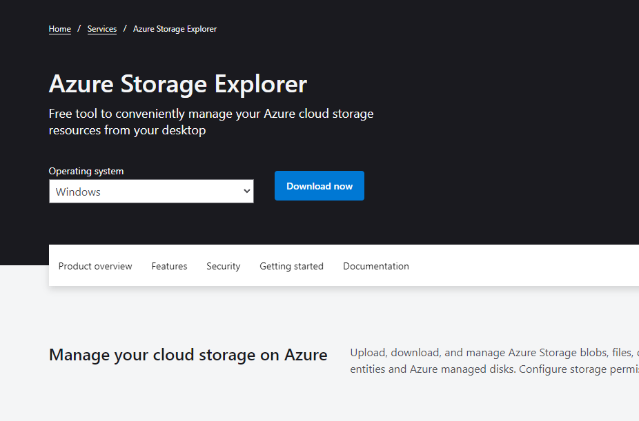

### Connecting to the table storage

Click on the connect button on the left of the application if the connect dialog is not already open.

If you have access to the Azure resource, you will be able to select the Subscription and browse to the storage service. If this is not the case, you can connect via the public key on the storage account. Follow the next instructions to connect via a connection string.

Select the &quot;Storage account or Service&quot; option.

Select the connection string option

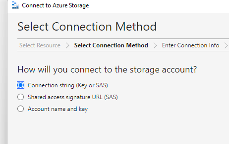

Enter a display name and the public access connection string of the account here. This is the same key as is used in the Default Connection String value used when deploying the application.

Once connected the service and related information will show up in the left tree pane

### Adding Town Entities

Click on the entity &quot;tbltowns&quot; and wait for the data explorer to open. Next click on the &quot;Add&quot; button to add a new entity.

Next, populate the details of the entity to be created.

- PartitionKey: This value must be &quot;dbe92660-56ab-4ed7-bc11-c2aa0e9ef0e5&quot;
- RowKey: A unique Id value identifying the town.
- PostalCode: Optional postal code of the town
- TownName: This is the display value that is used on the Application.

Click on insert once the information is correct. The application will reflect the changes the next time the user opens it.

### Adding Ticket Category Entities

Click on the entity &quot;tblticketcategory&quot; and wait for the data explorer to open. Next click on the &quot;Add&quot; button to add a new entity.

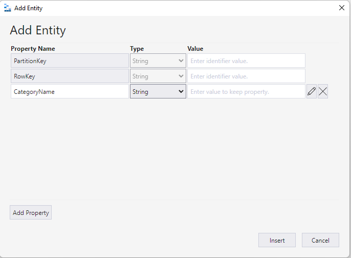

Next, populate the details of the entity to be created.

- PartitionKey: This value must be &quot;dbe92660-56ab-4ed7-bc11-c2aa0e9ef0e5&quot;
- RowKey: A unique Id value identifying the category.
- CategoryName: This is the display value that is used on the Application.

Click on insert once the information is correct. The application will reflect the changes the next time the user opens it.